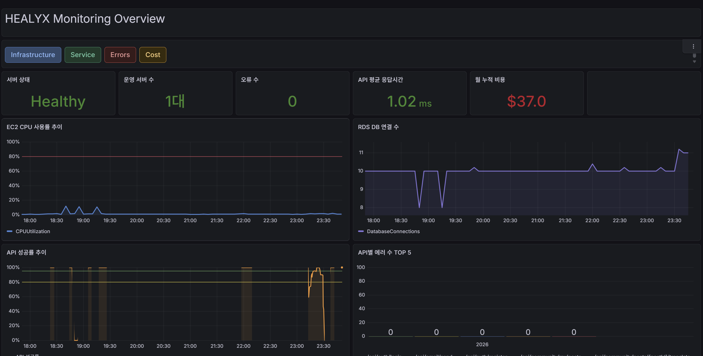
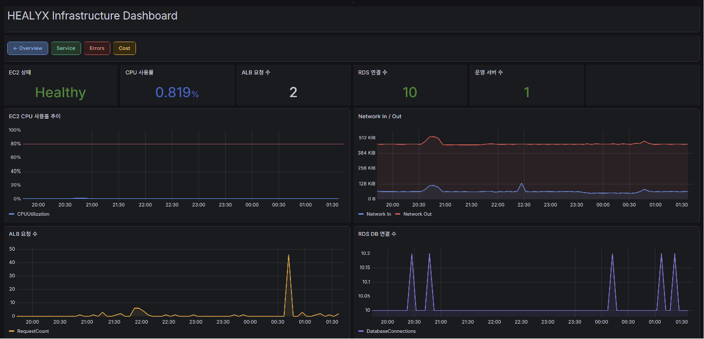
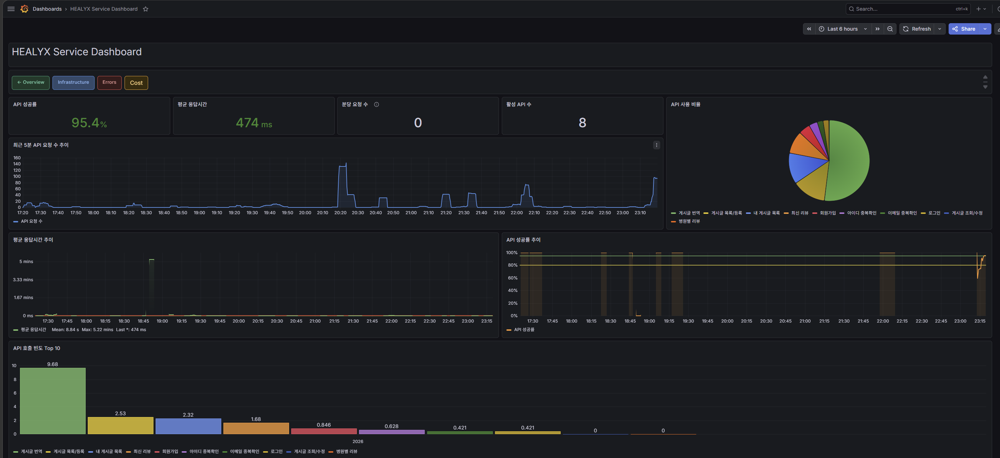
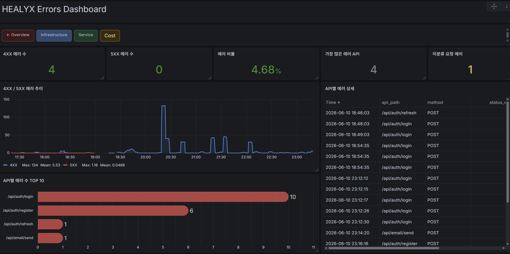
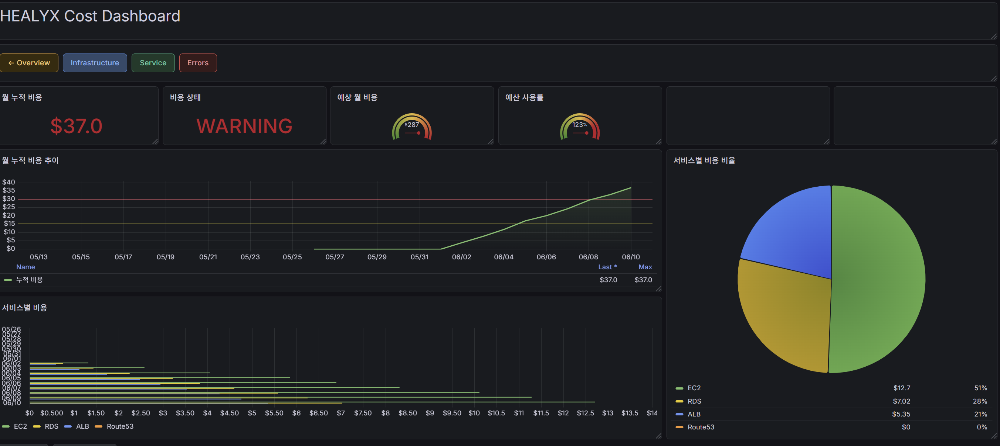

# Healyx Monitoring

> HEALYX 백엔드 인프라 모니터링 시스템  
> Prometheus + Grafana + AWS CloudWatch 기반 실시간 모니터링 대시보드

---

## 프로젝트 개요

HEALYX는 외국인 환자를 위한 모바일 헬스케어 앱입니다.  
본 레포지토리는 HEALYX 백엔드 서버의 인프라 및 서비스 상태를 실시간으로 모니터링하기 위한 Grafana 대시보드 구성을 담고 있습니다.

---

## 기술 스택

| 도구 | 역할 |
|------|------|
| Prometheus | 메트릭 수집 |
| Grafana | 대시보드 시각화 |
| AWS CloudWatch | 로그 수집 및 비용 모니터링 |
| Spring Boot Actuator | 애플리케이션 메트릭 노출 |
| Docker / Docker Compose | 컨테이너 실행 환경 |

---

## 아키텍처

```
Spring Boot 백엔드 EC2
  ├── /actuator/prometheus → Prometheus 메트릭 노출
  └── Docker awslogs 드라이버 → CloudWatch Logs 전송
          ↓
   모니터링 EC2 (t3.micro)
  ├── Prometheus (포트 9090) - 메트릭 스크레이프
  └── Grafana (포트 3000) - 대시보드 시각화
          ↓
   AWS CloudWatch
  └── 로그 그룹: healyx-backend
```

---

## 대시보드 구성

### Overview
전체 시스템 상태를 한눈에 확인할 수 있는 요약 화면



### Infra (인프라)
EC2 CPU, 메모리, 네트워크 사용량 등 인프라 지표 모니터링



### Service (서비스)
API 요청 수, 응답 시간, HTTP 상태코드별 현황



### Errors (에러 로그)
4XX / 5XX 에러 추이, API별 에러 현황, 실제 에러 메시지 조회



### Cost (비용)
EC2 및 ALB 운영 비용 모니터링 (CloudWatch Billing 메트릭 활용)



---

## 📁 레포지토리 구조

```
healyx-monitoring/
├── README.md
├── docs/
│   ├── images/                  # 대시보드 스크린샷
│   ├── architecture.md          # 아키텍처 상세 설명
│   └── dashboard-guide.md       # 대시보드 탭별 가이드
├── prometheus/
│   ├── prometheus.yml           # Prometheus 스크레이프 설정
│   └── docker-compose.yml       # Prometheus + Grafana 실행 설정
├── grafana/
│   └── dashboards/              # Grafana 대시보드 JSON (Import용)
│       ├── Overview.json
│       ├── Infra.json
│       ├── Service.json
│       ├── Errors.json
│       └── Cost.json
├── error-log/                   # 에러 로그 수집 관련 파일
│   ├── LoggingFilter.java       # API 요청/응답 로깅 필터
│   └── logback-spring.xml       # CloudWatch용 JSON 로그 포맷 설정
└── setup/
    └── install.md               # EC2 설치 가이드
```

---

## 백엔드 연동 내용

### 1. Prometheus 메트릭 엔드포인트 활성화
`application-prod.properties`에 prometheus 엔드포인트를 추가하고,  
`SecurityConfig.java`에서 `/actuator/prometheus` 접근을 허용 처리

### 2. API 로깅 필터 추가
`LoggingFilter.java`를 통해 모든 API 요청의 경로, 상태코드, 응답시간을 자동 기록  
5XX → ERROR, 4XX → WARN, 200 → INFO 레벨로 구분

### 3. CloudWatch 로그 연동
`logback-spring.xml`로 운영 환경에서 JSON 형식 로그 출력  
Docker `awslogs` 드라이버를 통해 CloudWatch 로그 그룹(`healyx-backend`)으로 자동 전송

---

## Grafana 대시보드 Import 방법

1. Grafana 접속 (`http://[모니터링 EC2 IP]:3000`)
2. 좌측 메뉴 → **Dashboards → Import**
3. `grafana/dashboards/` 폴더의 JSON 파일 업로드
4. datasource 연결 후 완료

---

## ⚠️ 보안 주의

- EC2 IP, ARN, 인스턴스 ID 등 민감 정보는 본 레포지토리에 포함되지 않습니다.
- `/actuator/prometheus` 엔드포인트는 외부 접근 차단 권장
