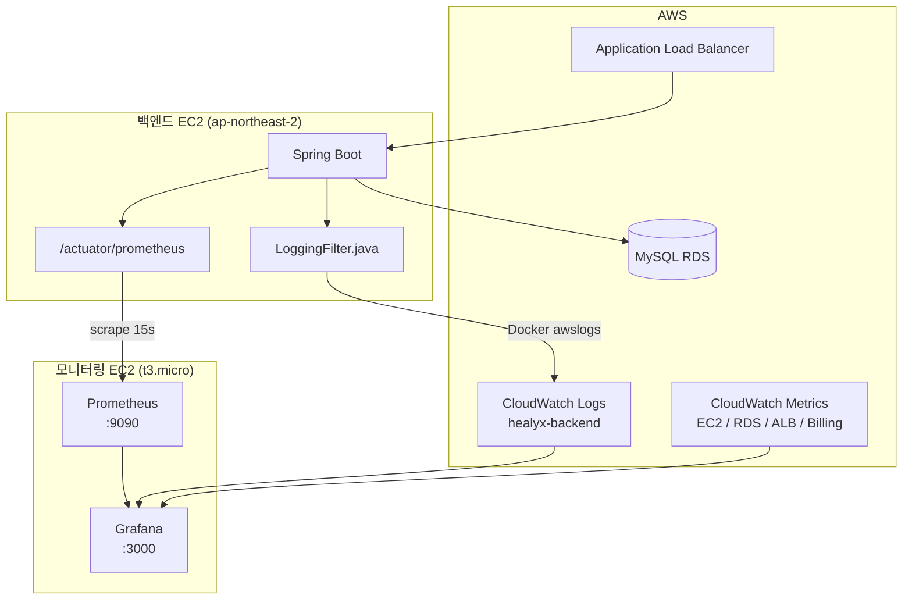

# 아키텍처

---

## 전체 구성도

---

## 구성 요소 설명

| 구성 요소 | 역할 |
|-----------|------|
| Spring Boot 백엔드 EC2 | HEALYX 앱 서버, Actuator 메트릭 노출 |
| LoggingFilter.java | 모든 API 요청/응답 로그 기록 |
| Docker awslogs 드라이버 | 컨테이너 로그를 CloudWatch Logs로 자동 전송 |
| CloudWatch Logs | 에러 로그 수집 및 저장 (`healyx-backend` 로그 그룹) |
| CloudWatch Metrics | EC2, RDS, ALB 인프라 메트릭 수집 |
| CloudWatch Billing | AWS 비용 메트릭 수집 (`us-east-1` 리전) |
| Prometheus | Spring Boot Actuator 메트릭 15초 간격 스크레이프 |
| Grafana | 수집된 데이터 시각화 및 대시보드 제공 |
| ALB | 외부 트래픽을 백엔드 EC2로 라우팅 |
| MySQL RDS | 백엔드 데이터베이스 |

---

## 데이터 수집 흐름

| 데이터 종류 | 수집 경로 |
|-------------|-----------|
| API 메트릭 (요청수, 응답시간) | Actuator → Prometheus → Grafana |
| 에러 로그 | LoggingFilter → CloudWatch Logs → Grafana |
| 인프라 메트릭 (CPU, 네트워크) | CloudWatch Metrics → Grafana |
| AWS 비용 | CloudWatch Billing (us-east-1) → Grafana |
